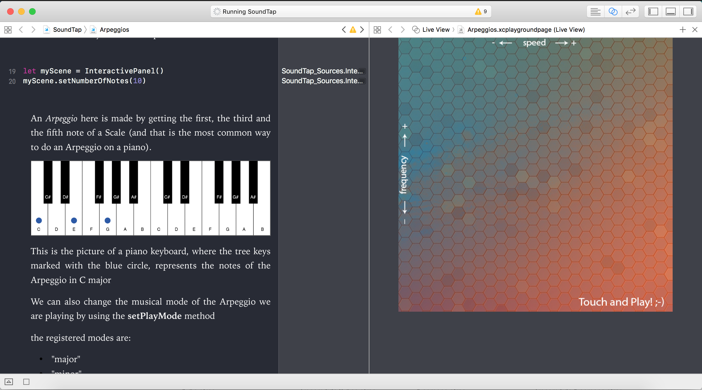

# Sound Tap
### Playground Submission for [WWDC17](https://developer.apple.com/wwdc/)

Sound Tap was my very first project in swift, right when I started on the Apple Developer Academy.

They encouraged us to make a submission to the WWDC Scholarship of a Swift Playground.
By that time, I basically had no idea of what to do, mostly because I had no experience in Swift,
but I decided to go with something I like.

I've always liked music, I play the piano since I was 8, so I wanted to transport that into the playground.

Using the AVFoundation Framework, you are actually able to create notes and use it to play customizable sounds.
*Sound Tap* was more like an experiment to see what I could do, it consisted on a rendered view - the *panel*- that would interact with your touch and play a programmed music.

So, you could just literally "code" your music by adding, what  called, a *half-tone vector*, that was basically a instruction to tell what note you were going to play after the current one, if the next number was zero, it was the same note, if it was 1 it was 1/2 tone higher, 2 it was 1 tone higher... and so on.

The playground even thought a little about Scales and Harmony, different Arpeggios, and how to make them sound better.

But the fun part was on *the panel*, depending on which position you tapped, the song played would be on a higher or lower tone and faster or slower.
So after programing a song, or just a sequence of notes, you could listen to what it sounds like indifferent pitches and speeds.

I was very proud of my first project on the Swift Playgrounds, but unfortunatelly I was not selected to the WWDC Scholarship. But it still was very fun to work on that, and I've reused that playground to teach a little bit of music and Harmony after - so it ws totally worth it 😄.

--- 
Sound Tap is a Xcode Playground, if you want to take a look, go to my GitHub repo [Playgrounds](https://github.com/giovaninppc/SwiftPlaygrounds) and download it.
