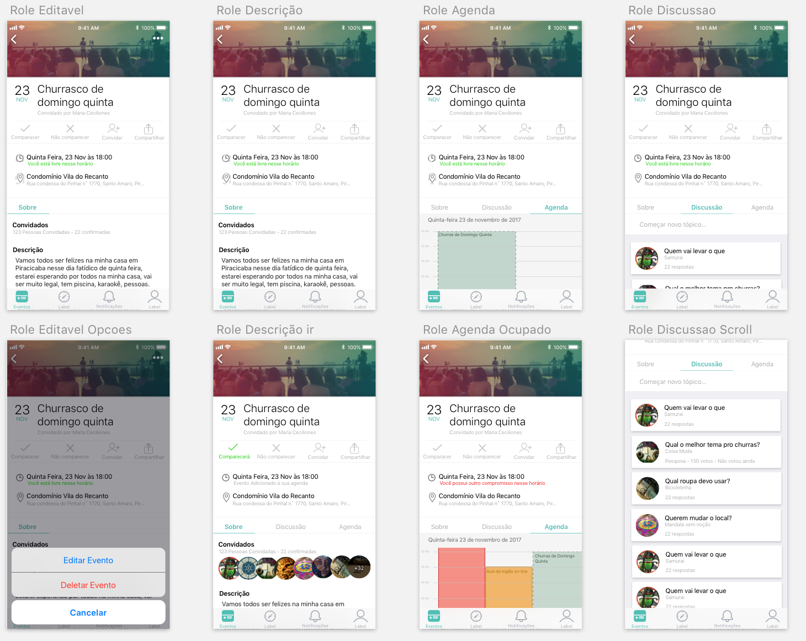
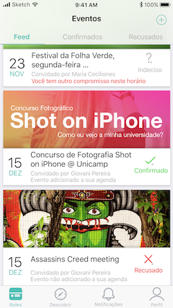

# Meet
##### [Worked as Designer and Front-end Developer]
###### 04/05/2018 - Meet is no longer available on the app store

Meet was a project created with 4 friends on the Apple Developer Academy.

The idea was to help friends meet. But how?
Trying to sugest the best schedule by checking when everyone is available.

Thales Biancalana worked, mostly, as the Back-end developer, creating the server for the Meet application and all the data transactions between them.
The both Felipes were the main Front-end developers, and I (Giovani) was the project only designer and Front-end developer.

It was a bit of a challenge working on the design of this application, the main problem was that we had a lot of information to be displayed at once, and no simple way to show it to the user. We made several different designs and screen trying to find the best solution for it.

Another problem was to simplify the user interaction - we wanted to show a lor of information, but request the minimum from the user.
One part of the solution was to get the information before the moment the user was using the app.
He could log into his schedule on the app, or load it directly from his *Agenda*, so when creating a new event for his friends, he doesn't need to worry about inputing the information, because it was already there.

---
Team Members:

[Felipe Scarpitta](https://www.facebook.com/scarpz)

[Thales Biancalana](https://www.facebook.com/thales.gaddini)

[Felipe Izepe](https://www.facebook.com/felipe.izepe)

[Giovani Pereira](fb.com/giovaninppc)
