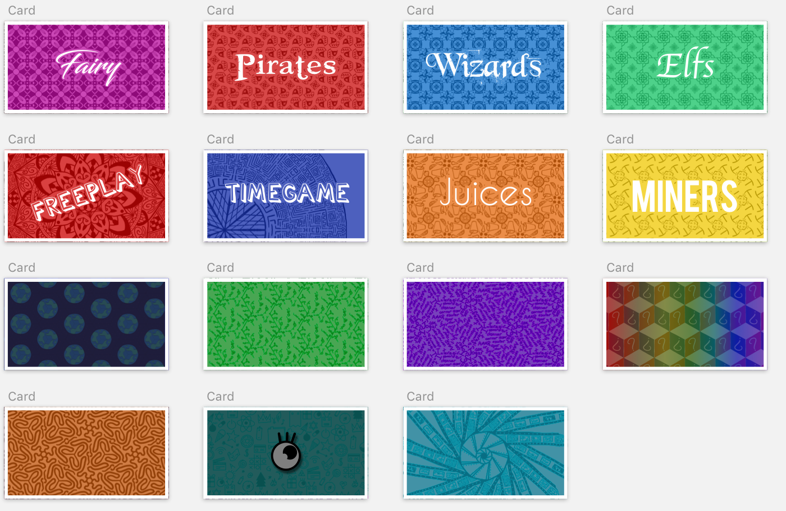
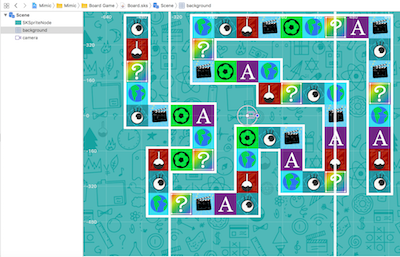

# The Game of Mimic
##### [Worked as Designer and Developer]

InterAção is a Game not to be played alone.
The idea was for you to get friends or family together and have a good time.

I've always enjoyed playing Mimic, and working on InterAção have been great. It was the first app I developed entirely by myself. All the assets, images, code, animations... everything, and it was fantastic.

## Artwork

Every image, asset or cartoon on *InterAção* was hand drawed using an iPad. I wanted it to have a personal touch, so I created all the designs by myself.

Using some apps on iPad, such as the [Illustrator Draw](https://www.adobe.com/br/products/draw.html), it was pretty easy to create vector images and export them into desktop applications to be processed, edited and later, imported inside the game.

The background music was also created on an app, it was made using the iPads [Garage Band](https://itunes.apple.com/br/app/garageband/id408709785?mt=8).

## The Code

InterAção ended up being a big project - what I thought at the begining that would be simple, actually was accomplished after a lot of effort. 

Due to it's nature, I had to make a nice configuration of database - to load and store all the game words.

I decide to use the [Realm Database](http://realm.io), imported as a *Pod*.

And it worked amazingly. Realm is a really fast database, that saves Objects, and much easier to use than CoreData. It proved to be reliable and very consistent.

If you are going to use Realm on a project, a tip I can give is to really plan your stored Objects properly. After releasing InterAção - I decided to make an update which involved an in-app purchase to the players include their own words into the game.
It changed the way things were being stored - it was no longer a static information, to only be read - now it needed to be updated and changed according to the player. But I had to make a few changes on the object I used to store this information. And there was the problem.

Changing this object made the previous version of the database, inconsistent - and it was already on the app store 😱. Making the migration from one model to another is possible (and in the end thats what I did), but is a handfull. It's much better if you don't have to worry about it - specially because inconsistencies on your database model, will most likely, make your application crash.

Apart from the database, the rest of the game was made using *UIKit*, including the cards aniamtion, and *Sprite Kit Tiles* to make the board.

Using the Tiles, was much easier to define the position of the pieces, and to move them around the board.

## Cross Play

One of the most charming features of InterAção, is the *Cross Device Play*, where you can use two devices simultaneously: One as a Game Board, and another dedicated to show the words to the players.

That was made using the [Multipeer Conectivity](https://developer.apple.com/documentation/multipeerconnectivity) Library, a framework already available on Xcode, and created by Apple. It uses Wi-Fi, Bluetooth and P2P connection to communicate across devices (the technology used does not need to be all those three at once, but the operating system can choose what is more relevant at each time).

## Localization

Localizing an app usually takes a lot of work.
But this was absolutelly beyond it.

Besides having to configure and translate all the sentences, labels, buttons... InterAção has a collection of almost 5K words that needed to be translated too.

Making a localization, translating all the assets, is kinda boring. But it's worth it. I recomend if you a looking to do something similar, start with a language you are familar with. Sometimes, simple senteces have totally different meanings if translated literally, and you will only know, if you are comfortable on the lenguage you are translating too.

Also, the translation process on Xcode doesn't help a lot. I recomendo you create a **Localizable.strings** file on your project, to keep all yout strings, since the beginig. Even if you don't think in translating it now.
But if you are going to do this anytime, it will save you a lot of time. Plus, removing big sentences from your code and putting into the **Localizable.strings**, improve the readability of it.

## Sticker Pack

While I was codign the main parts of the game, I thought: "I've already drawed all these images, I could use them to something else, maybe something that people could use it..." Nad the idea to start a Sticker Pack had started. Using the same images, and adding some text, I created my first sticker pack - InterAção style.

---

If you want to play it, [InterAção](https://itunes.apple.com/us/app/intera%C3%A7%C3%A3o/id1332635230?mt=8) is available at the app store 😉.

