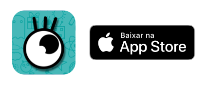

# The Game of Mimic
##### [Worked as Designer and Developer]

InterAção started as a funny idea.

It was around Christmas, and I was talking with my little brother. Since I went to university on a different city, I didn't spend too much time at home, and it was nice to keep up with my family everytime possible.

And we really like to play Mimic games. He decided to buy a new one, and I took him to the game stores downtown, but... We didn't find anything - or we did but it was SO F* EXPENSIVE we gave up buying it.

Thats when I said: "We can make our Game! Let's make an app of a Mimic Game, so we can add the words we want, as many as we want, you can lear a little about app development, and we'll make a nice project together!"

Needless to say that he really got into it. We started designing and coding the app that same day. 

We wanted it to be our app, so we made everything. All the images were hand drawed, all the animations, we composed all the game songs, had all the ideas (of course, our bigger brother was there to hel us too), but mainly I coded and he drawed.

We couldn't be happier with the results, it all worked! And it was really fun to play.

We lost a lot of time playing with friends, familly, friends friends, family friends, and anyone who would like to try it. And it was the very first app I published all by myself.

If you want to play it, [InterAção](https://itunes.apple.com/us/app/intera%C3%A7%C3%A3o/id1332635230?mt=8) is available at the app store 😉.

