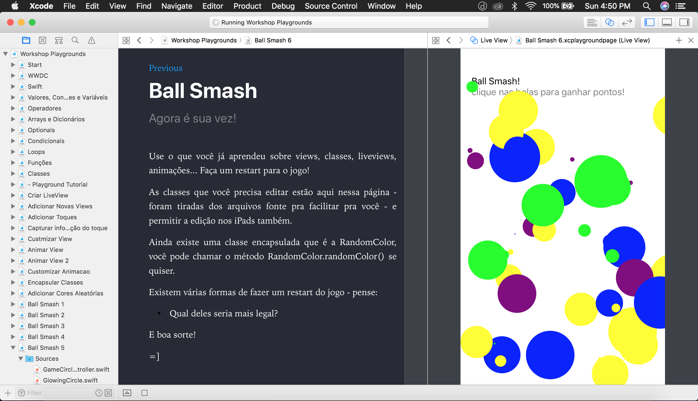

# Swift Playgrounds
## And easy tutorial for Swift language, and app development introduction [available in Portuguese]

You will learn:
- Swift language basics
- iOS and Playground view lifecicle 
- Gestures and user interactions
- Display itens on screen

---

If you are new on iOS app development, or swift, or coding at all, maybe a good introdution would be a Swift Playground.

But, what's that? Its like a *mini app*, a file format tha Apple created to help teach and learning swift development. And it's available for the Xcode on Macs, and an iOS app for iPads as the [Playground app](https://itunes.apple.com/us/app/swift-playgrounds/id908519492?mt=8).

What I've done, was a little tutorial to introduce the Swift programming language, and also the begining of app development, all condensed in the form of a Swift Playground.

You can get the tutorial on my GitHub repo - [SwiftPlaygrounds/WorkshopSwiftPlaygrounds](https://github.com/giovaninppc/SwiftPlaygrounds/tree/master/Workshop%20SwiftPlaygrounds%202018), 
just download it - the Xcode or the iPad version, and open the file.

> If you are downloading the iPad version, download on a Mac and than share with your iPad using Air Drop, if you have the Playgrounds app installed, it will automatically import it. Or, if you dont have a Mac, share with the iPad after downloading as an email, or other transfer app.

---

At the and of the Playground, you will be able to create a simple mini-game: The **Ball Smash**

---

Coding is really fun.

It's just like magic, you have an idea, and you make it happen, and than you show it to other people, and suddenly there are a lot of people using it.
There is a nice feeling of accomplishment.

I super recommend it 😁.
