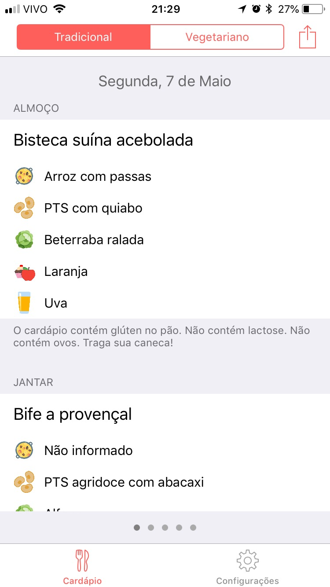
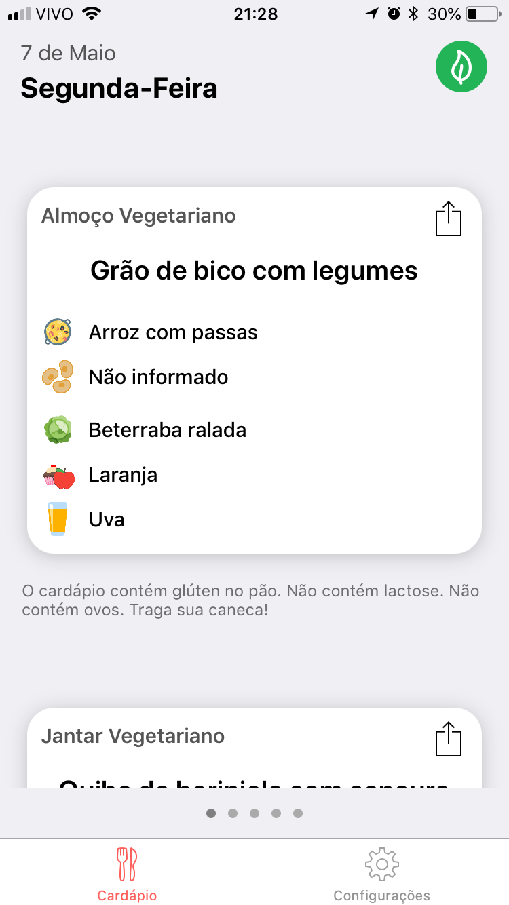
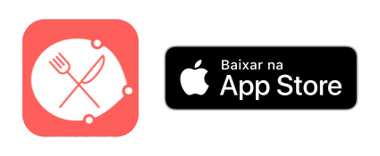

# App for Unicamp's Universitary Restaurant
##### Worked as Designer

I'm a student on the University of Campinas, and also a Student at the Apple Developer Academy @ Instituto Eldrado.

We are always encouraged to try solving peoples problems and help the ones around us.

[Bandex](https://itunes.apple.com/us/app/bandex/id1247437596?mt=8) was a initiative to help the students to have an easier way to look into the Universitary Restaurants Menu.

Unicamp, is a public school, and most of the students dine and have lunch on one of the three Universitary Restaurants (called *Bandejões* by the students) because they are much cheaper than the other options available. 
The problem was that, the access to the information of what the Restaurants were going to serve was not easy: you had to log into you University account, go to the main page and look into today's scheduled meal.

So, I teamed up with a group of friends, who also were Students at the Apple Developer Academy, to make a better solution for that.

And we came up with the Bandex app.

---
### University API and App

The first thing we had to do was get acces to the university menu - so we asked permission to have acces on the University's API that allows to read this information.

**Gustavo Avena** was the main leader of the project, the person who got the permission to acces all the necessary data. He also programed all the server to read, treat, and convert the information to be easier to use on the app.

**Bianca Itiroko** and **Julianny Favinha** were the main *front-end* developers, implementing all the user interaction, and all the crazy ideias the designers had.

And finally, **Larissa Ganaha** and me (**Giovani Pereira**) worked as the app's designers. We tried to make the most simple interface as possible, but that delivered the information we needed. She worked on created the identity of the app - colors, fonts, app icon, transitions... - and I worked on the screen arrangements, display order and icons to make faster the way users read the information.

What we were really happy to use as a solution, was and iOS Widget. It allowed the users to see the Menu without openning the app - and that was our best feedback. And also scheduled notifications - that came out on our second version of the app - so users could decide when it was better to receive a little reminder of today's meal.

The app's first version, back in 2017, had a really plain and simple design.
We used tables to display the information - it was clear, but not that pretty.

This year we worked on our latest update, where we droped that explicited table, and startd using cards.
The information is essentially the same, but that's much nicer to look at. And also, the transition between the vegetarian and the regular Menu is now easier, by using the top green button on screen.

---
**Team Members:**
[Gustavo Avena](https://www.facebook.com/gugaavena) - Back-end Developer

[Bianca Itiroko](https://www.facebook.com/bianca.itiroko) - Front-end Developer

[Julianny Favinha](https://www.facebook.com/julianny.favinha) - Front-end Developer

[Giovani Pereira](fb.com/giovaninppc) - Designer

[Larissa Ganaha](https://www.facebook.com/larissa.ganaha) - Designer

---
If you want to take a look (or you are a nem member of Unicamp's community and want to use it), download Bandex on the App Store:

