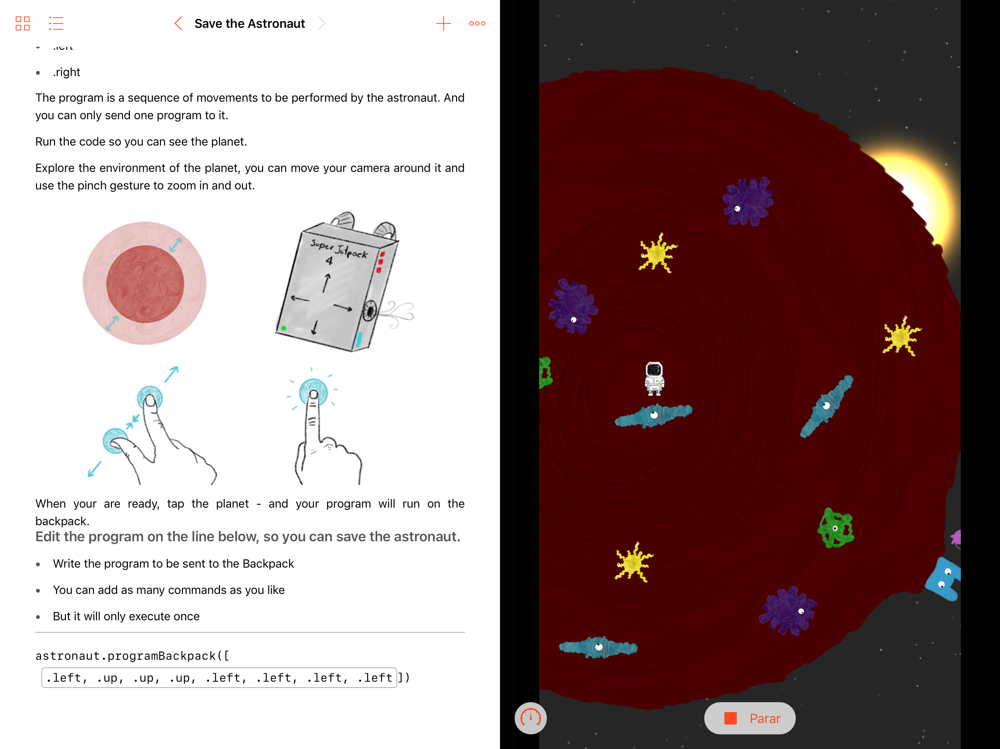

# Swift Playgrounds
## And easy tutorial for Swift language, and app development introduction [available in Portuguese]

Hueco Mundo was my Playground Submission for the [WWDC18](https://developer.apple.com/wwdc/).

If you are not familiar with that, the *WWDC - World Wide Developers Conference* of Apple, is a year event of developers, which brings together developers from all around the world to see and learn more about the new features on the Apple hardware and softwares - like, iOS updates, new frameworks...

And every year, they have this *Scholarship*, to take students, from all around the world, to watch the entire conference. This year, you had to make a Swift Playground and submit to them.

I decided to make a hand drawed story. About a little astronaut who got stucked inside a hollow world, and can't leave by himself.

The idea is that the reader had to program the astronaut backpack in order to make a rout out of the hollow world.

He would then load the program into the backpack and hope that the astronaut would leave the planet safely.

And I made everything on a PlaygroundBook - the Playground format which runs on iPad - because I believed the touch was a much better way to interact than using a mouse for this application.

---
Unfortunatelly, my playground was not selected for the scholarship.
But you still can take a look downloading it from my GitHub repo [SwiftPlaygrounds/Hueco Mundo](https://github.com/giovaninppc/SwiftPlaygrounds/tree/master/Hueco%20Mundo)

All the visual assets were made by handrawing on an iPad using the [Adobe Sketch](https://www.adobe.com/br/products/sketch.html) app.

The background Music was made using the Oriental Loops package on iPad's [Garage Band](https://itunes.apple.com/br/app/garageband/id408709785?mt=8).
