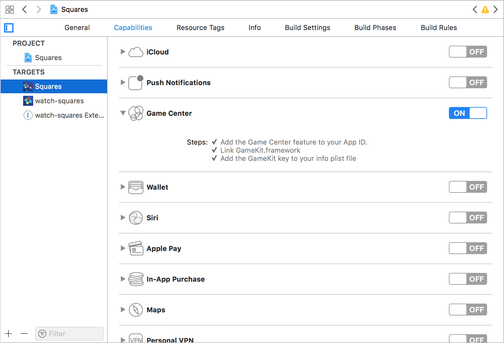
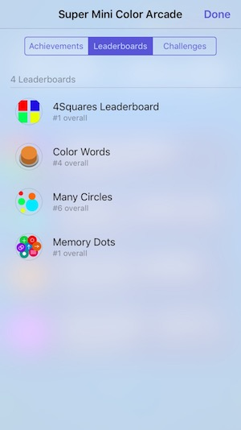

# iOS Leaderboards

###### [Swift • iOS • GameCenter • Game • Center • Swift4 • Tutorial • Leaderboard]

### Why create leaderboards
Leaderboards are a great way to make your users/players more interested on your Game (or app), and creates a sense of competition, because now they can challenge their friends and have worldwide positions.

So, let's see how to make it:

### Create the Leaderboard on iTunes Connect / App Store Connect
###### iTunes connect or Apple Store connect (apparently Apple changed it's name recently after the WWDC2018)

First of all, you will need your app created and registered on the iTunes Connect, then go to your app page on the Features tab, and on the Game Center section.

There, you will see the **Leaderboard** section with an addition button (+). Press the button, and a pop up to configure the Leaderboard will appear. Set it as an single Leaderboard, and provide all the information, like display name, ID (this is important, save this information for later), and the points format, type, etc.

Here you can also add a image to your Leaderboard, on the localization section.

Save your new Leaderboard.

### Add the information to your code

Now, you will need to enable the Game Center on your app.
Go to the app's capabilities and make sure you have enabled the **Game Center** capability.



To make easier to get the information of your Leaderboard ID, make a Reference class, and add your ID as a constant:

```swift
class Reference {
	let LEADERBOARD_ID = "leaderboard.registered.bundle.id"
}
```

Great! Now you are ready to submit your player score to the Game Center Leaderboard.

After you have your player's new best score, you will need to make a Game Center Score object, with the Leaderboard ID referenced, add the points to it, and just send to the Game Center (remember to ```import GameKit```).
The following code will just handle it:

```swift
func addScoreAndSubmitToGC() {
    // Get the current score
    var score: Int = points
    // Get the Leaderboard ID
    var IDn: String = Reference.LEADERBOARD_ID
    
    // Create a GKScore object and add the points to it
    let bestScoreInt = GKScore(leaderboardIdentifier: IDn)
    bestScoreInt.value = Int64(score)
    
    // Submit score to GC leaderboard
    GKScore.report([bestScoreInt]) { (error) in
        if error != nil {
            print(error!.localizedDescription)
        } else {
            print("Highscore sent to GameCenter")
        }
    }
}
```
If everything goes right, the value will be correcty updated on the Game Center.

### Open the Leaderboards

To show the Leaderboard view, you will need to make an instance of a GameKitSceneViewController, set it to the Leaderboard state, and present it on the current screen.

First, make the current viewController a *GKGameCenterControllerDelegate*, so this view controller can handle the GameKitSceneViewController presentation and dismiss:

```swift
extension viewController: GKGameCenterControllerDelegate {
    func gameCenterViewControllerDidFinish(_ gameCenterViewController: GKGameCenterViewController) {
        gameCenterViewController.dismiss(animated: true, completion: nil)
    }
}
```
And then, you can call the following code to show your leaderboards.

```swift
func showLeaderboards() {
    let gcVC = GKGameCenterViewController()
    gcVC.gameCenterDelegate = self
    gcVC.viewState = .leaderboards
    gcVC.leaderboardIdentifier = Reference.LEADERBOARD_ID
    present(gcVC, animated: true, completion: nil)
}
```
Remember to import the **GameKit** library.

Here's an example of leaderboards, from the [Super Mini Color Arcade]() game:



#### Important:
The values, persistency, and everything are handled by the GameCenter, all you need to do is send the value through a ```GKScore.report```, so make sure you are sending the correct values to the Game Center!

---
###### Cover image <a href='https://www.freepik.com/free-vector/memphis-pattern_1177561.htm'>designed by Freepik</a>