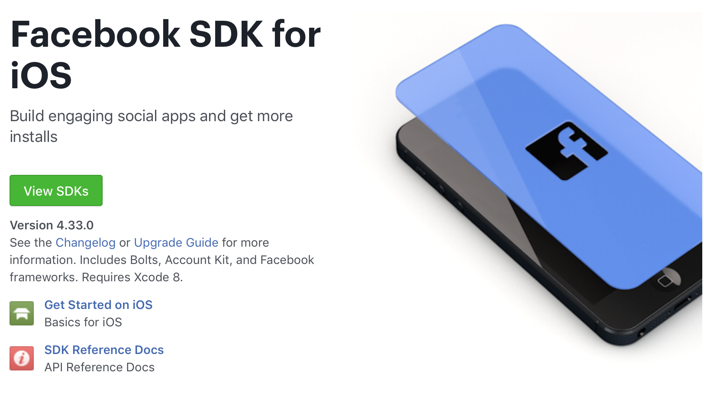

# Facebook SDK for iOS (Swift)
### Why use it?

The last project I was,
I worked as developer, on front and backend. At some point, we decided to make a Facebook integration - just the basic, the user would be able to login, and share some information on Facebook.

But, why would you add the Facebook SDK to your app?
First of all, you get access to all the Facebook support or apps, it includes the Facebook analytics, which can be pretty useful if you want to get more information about your users.

And also access to all the functionalities available, instagram, pictures, friends, tags, the very own Facebook... And I think we all know that making your app a social thing, can make it escalate much faster.


## Get started

The first thing you need to do is set up a Facebook Developer account,
just log in to your facebook account and go to [developers.facebook.com](developers.facebook.com).

Once finished, you will be able to create your first app on the Facebook - every app you want to integrate with the Facebook SDK, you first need to "create it" on your developer account.

Then, you go to the *settings* section on your aps Dashboard, and fill the information.
Add a new platform (iOS), and fill with the correct Bundle ID. More information like *iPhone Store ID* will be available after your app is on the app store.

### Add the SDK to your project

There are 2 main ways you can add the Facebook SDK to your project:

- Download it and add to the Frameworks folder
- Add to your Pods

I've used the second option. Open your podfile - if don't have a podfile type ```$ pod init``` on the command line, and than open the Podfile.
If you don't have the cocoapods installed, run ```$ sudo gem install cocoapods``` before.

Add the Facebook pods typing on the file:

```
pod 'FacebookCore'
pod 'FacebookLogin'
pod 'FacebookShare'
```
and then run ```pod install```.

After the pods are installed, open the *project*.xcworkspace file created.

Now, open your app's info.plist and add the following lines into the body of your file (between the tags <dict>...</dict>)

```plist
<key>CFBundleURLTypes</key>
<array>
  <dict>
  <key>CFBundleURLSchemes</key>
  <array>
    <string>fb116151079257162</string>
  </array>
  </dict>
</array>
<key>FacebookAppID</key>
<string>116151079257162</string>
<key>FacebookDisplayName</key>
<string>PhotoWall</string>
```

If you are going to use Facebook dialogs, such as a share view, login or app invites, also add:

```plist
<key>LSApplicationQueriesSchemes</key>
<array>
  <string>fbapi</string>
  <string>fb-messenger-share-api</string>
  <string>fbauth2</string>
  <string>fbshareextension</string>
</array>
```

You'll also need to add it to your AppDelegate class.

```swift
func application(_ application: UIApplication, didFinishLaunchingWithOptions launchOptions: [UIApplicationLaunchOptionsKey: Any]?) -> Bool {
        FBSDKApplicationDelegate.shared.application(application, didFinishLaunchingWithOptions: launchOptions)
        return true
    }
```

## Log In

### Facebook Login Button
The easiest way to make the Login is using the facebbok login button.


Just add the following code:

```swift
func addFacebookButton() {
    let loginButton = LoginButton(frame: CGRect(x: 0, y: 0, width: 250, height: 100), readPermissions: [.publicProfile])
    loginButton.center = self.view.center
    self.view.addSubview(loginButton)
}

```

And you can already start performing logins.

Note that all the *permissions* you want to get from the user, you will need to specify on the *readPermissions* parameter. The publicProfile is available by default, it means you will need no further requests or user permission to have it, and it include the username, the profile picture and the user email, basically.

### Custom Button

But, if you don't want to use the Facebook button, you can create your own button or action to login, and call the following method:

```swift
func loginToFacebook() {
    let loginManager = LoginManager()
    
    loginManager.logIn(readPermissions: [.publicProfile], viewController: self) { loginResult in
        switch loginResult {
        case .failed(let error):
            print(error)
        case .cancelled:
            print("User cancelled login")
        case .success(let grantedPermissions, let declinedPermissions, let accessToken):
            print("Logged in \(grantedPermissions) \(declinedPermissions) \(accessToken)")
        }
    }
}
```

it will open a webView, on the Facebook webite, requesting the user permission to log in to your app.
Check that its very similar to the Facebook button aternative.


## Share to Facebook

Sharing information to Facebook is also very simple.
All you need to do is create a *GacebookSharingContent*, and then a *SharingDialog*, it will get the content, and open the Facebook app or a sharing view so the user can share it to his Facebook. Here is an example of how to share an Image to Facebook:

```swift
func shareToFacebook() {
    guard let image = UIImage(named: "sharingImage")
    let photos = PhotoShareContent(photos: [Photo(image: image, userGenerated: false)])
    let shareDialog = ShareDialog(content: photos)
    shareDialog.mode = .native
    shareDialog.failsOnInvalidData = true
    shareDialog.completion = { result in
        // Handle share results
    }
    do {
        try shareDialog.show()
    } catch {
        print(error.localizedDescription)
    }
}
```
if everything goes right, a sharing dialog will appear, and the user will be able to share the selected image.


## More information

Basically **where to go from here**, a nice step is reading the Facebook Documentation, they are actually really good, step by step, and pretty simple to be understood.

They are all available at the [Facebook Developers Documentation](https://developers.facebook.com/docs/ios/).



---
I hope this post was useful to you 😉.