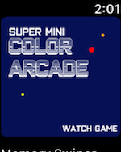
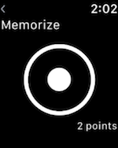

# Super Mini Color Arcade on Apple Watch

That's right!
Super Mini Color Arcade is finally comming to Apple Watch
(I'm sure you didn't expect that, right?).

For the firts version, the WatchApp come with a single mini game, a gesture memory game.

The idea is that over the time, both the iOS version and the watchOS version will recieve new mini games.

Working with the watch design is way different from the common app design. You have to think about your animations, so they won't take too much battery, your colors and fonts, because they must be visible on a really small screen, and many other aspects.

The memory Game was created using only the **WatchKit**, although a version of the **SpriteKit** is also available on the Apple Watch.

On the game, the player will recieve a sequence of images, which each image represents a gesture, that later he will need to replicate on the forms of the gesture. If he gets everything correct, he'll go to the next level!

And, such as the original iOS version, the entire game was designed and developed by me 😬. The watch version was more of an experiment, trying to see new platforms and features.

I discovered a lot of things that I didn't even know that existed (possibly because I don't have an Apple Watch myself 😅), but that small gadjet has a lot of things that can be done. I hope to learn more and add more features to the game soon.

---

If you want to play The **Super Mini Color Arcade**, the watch or the iOS version, you cand download it from the app store:

###### Cover Image Background <a href='https://www.freepik.com/free-vector/vintage-clocks-pattern_857152.htm'>designed by Freepik</a>
