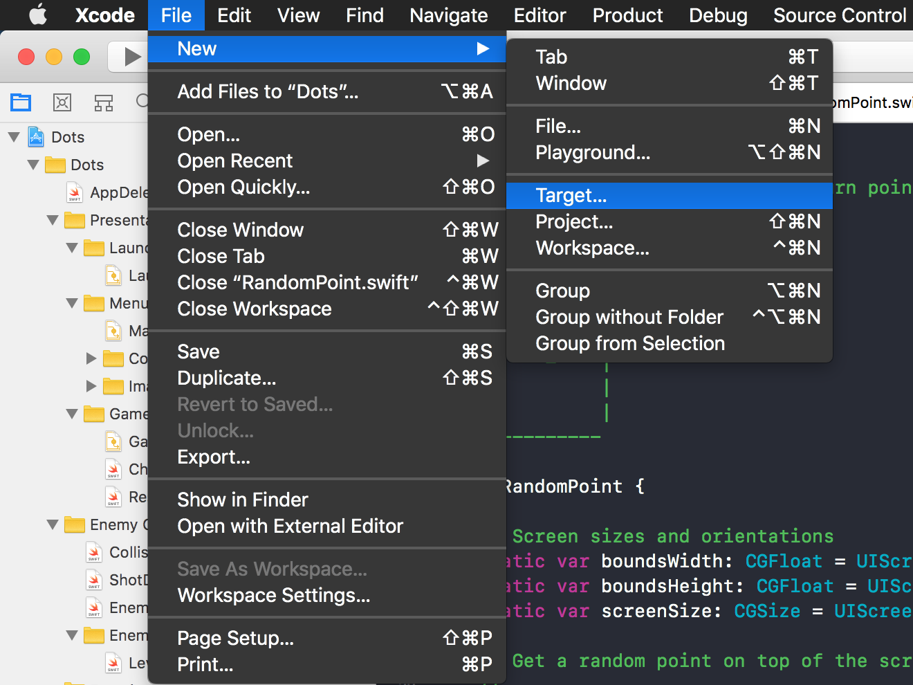
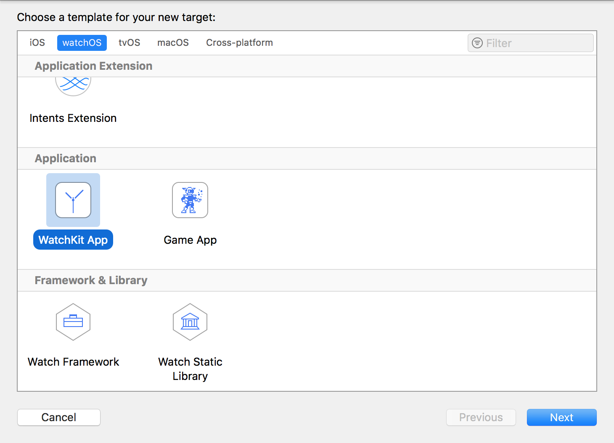
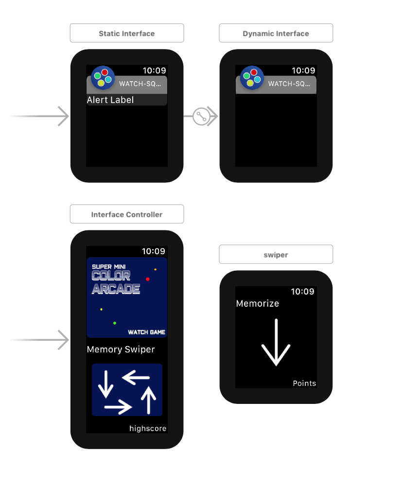
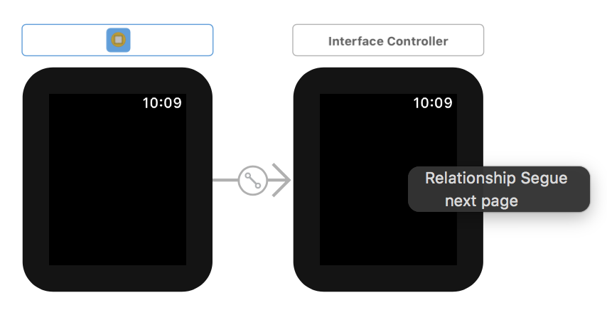
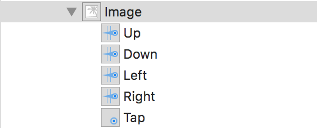
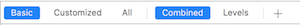
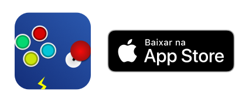

# Desenvolvendo apps para Apple Watch

Na última semana eu fiz a versão do Super Mini Color Arcade para Apple Watch, foi o primeiro app que publiquei para Watch apesar de ja ter mexido na plataforma antes, e com isso aprendi algumas coisas que podem ajudar principalmente os marinheiros de primeira viagem.

## Criar Projeto

### Adicionar watchOS target

Eu fiz a partir de um projeto iOS já existente - File->New->Target



e depois selecione a opção de WatchKit app (Se você for fazer um jogo, considere a opção do Game App - existe um SpriteKit adaptado para Apple Watch, com o quel eu não mexi, mas parece interessante).




O se projeto de Apple Watch já estará criado e associado ao do iOS.

### Interface Builder (Storyboard)

Muito similar ao já de apps iOS (se você está familiarizado), mas com algumas diferenças.

### WatchKit

Outra diferença é que você não estará usando o **UIKit** do iOS, mas sim o **watchKit**, que no fundo no fundo são muito semelhantes, você acessa as propriedades dos seus objetos instanciados e modifica ainda como quiser. Mas por exemplie, não existe mais **TableViews** agora são apenas **Tables**.

Você ainda pode *ligar* os objetos do storyboard ao código usando @IBOutlets normalmente. Abaixo um exemplo tirado direto do SMCA:



O que você deve ter notado de diferente são as entradas de Static Interface e Dynamic Interface (o que são para que servem onde habitam?) - mas não se preocupe muito com elas.

O que acontece é que, apps iOS podem receber notificações, e caso tenham uma extensão para watchOS de notificações, essas também vão aparecer no seu Apple Watch.
Mas não se preocupe muito com isso, apenas deixa essas duas interfaces ali, você não precisa modificá-las caso não queira.

Outra coisa legal é o scroll automático, se você notar, o Interafce principal na imagem de cima é enorme - e não tem nenhum Watch desse tamanho todo. Mas o watchKit faz o scroll automático nesse tipo de tela, tanto pelo touch, quanto pelo uso da coroa do Apple Watch.

### Navegação

A navegação do app em watchOS tem uma particularidade interessante: **Ela só segue uma direção**. Como assim?

Existem duas formas de ligar os Interface Controllers: lateralmente, ou através de push. Mas nunca **as duas ao mesmo tempo** (pelo menos é o que diz a documentação oficial, e eu realmente aão consegui fazer as duas porque ele gera um erro assim que a mistura de navegações é detectada).

#### Navegação horizontal
Ligue as interfaces com a relação do tipo **Next Page**, isso já fará automaticamente que o seu app seja **paginado**, permitiando rolar entre suas páginas.



### Navegação por push
Essa é a utilizada no SMCA, e a mais *comum* de iOS, quando coloca uma página por cima da outra, com o botão de voltar em cima.

Para isso, basta ter 2 Interface Builders diferentes, com identificadores distintos.
Você então adiciona uma ação que faz o seguinte:

```swift
@IBAction func gotToNextScreen(_ sender: Any) {
        self.pushController(withName: "nextScreen", context: nil)
}
```

Isso já gera a navegação, o botão de voltar, o título e tudo mais automaticamente, então configure tudo bonitinho.


> **Dica** - Usar mais de um storyboard é sucesso, mas diferente também. Dentre todos (TODOS) os seus Interface Builders, apenas um deve ser marcado como **Initial Controller**, mesmo se em Storyboards distintos.


### Gestos
Eu tive um pouco de dificuldade de instanciar os gestos programaticamente como estava acostumado no iOS:

```swift
let gesture = UIGestureRecognizer(...)
self.view.addGestureRecognizer(gesture)
```

ENTÃO, usei os gestos instanciados diretamente no storyboard (se você jogou o SMCA versão de Watch, vai ver que ele tem um jogo da memória de gestos, então mexi bastante com eles).



Adicione os gestos onde você quer que eles atuem, e faça um Outlet do tipo **Action** para captar os gestos.

"*Ah, mas e se eu quiser configurar os gestos, como mudar duração, tamanho do swipe e tudo mais?*"

Faça um Outlet comum e altere essas propriedades quando a tela for instanciada.

```swift
@IBOutlet var down: WKSwipeGestureRecognizer!
@IBOutlet var left: WKSwipeGestureRecognizer!
@IBOutlet var right: WKSwipeGestureRecognizer!

override func didAppear() {
    super.didAppear()
    down.direction = .down
    left.direction = .left
    right.direction = .right
}

```

### Importantíssimo para Desenvolvimento em Swift
Se você está desenvolvendo em Swift, existe um bug na interface Xcode Watch que não aparece em testes do simulador. (Acredite, eu levei uns 5 dias até achar isso), onde o app não começa nunca. Ele carrega mas fica em **load infinito**.

Para resolver esse problema, você deve adicionar uma opção no modo de build do seu app.

Vá em **PROJECT**, para adicionar as configurações para o app todo e clique no **+** para adicionar uma nova opção.




Digite na linha:
``` STRIP_BITCODE_FROM_COPIED_FILES ```
e coloque como ```NO```.

Isso deve resolver o problema.

> De novo, isso já era um erro conhecido para o qual encontrei solução nos fóruns da Apple.

## Dicas de Design

Acho que do lado de desenvolvimento uma coisa tem que ficar muito clara **Você está rodando em um relógio**, ou seja, sem muito processamento e **bateria** disponíveis.

Use animações moderadamente e desative-as sempre que possível - para não gastar processamento calculando as suas animações.

Prefira o background preto - quanto menor o uso de cores e luzes, menos bateria você gasta - mas faça um bom trabalho de branding para mão perder a indentidade do seu app.

Leve em conta qual o tipo de transição/navegação que será utilizada no seu app também.

## Subir para a loja
Com o app associado a um de iOS é bem simples mandar seu app para a loja, e basicamente os mesmos passos de um app iOS.

Registre seu Bundle e adicione o app no **App Store Connect** (antigo iTunes Connect), faça um **Archive** do app e através da janela **Organizer** faça upload.

O que você vai achar estranho é que não vai aparecer nada de Apple Watch, ele vai estar todo como iOS app.
Mas assim que você adicionar uma nova versão de app para mandar pra review, e selecionar uma Build que tenho o watchOS integrado, aí vão aparecer as opções do watch, a seção para adicionar screenshots e tudo mais.

---

Boa sorte desenvolvendo seu app para watch! Se esse tutorial te ajudou, conte pra mim depois 😉.

Se quiser jogar o **Super Mini Color Arcade**, para Watch ou iOS, baixe agora na app Store:

[](https://itunes.apple.com/us/app/super-mini-color-arcade/id1375643857?mt=8)


###### Cover Image: <a style="background-color:black;color:white;text-decoration:none;padding:4px 6px;font-family:-apple-system, BlinkMacSystemFont, &quot;San Francisco&quot;, &quot;Helvetica Neue&quot;, Helvetica, Ubuntu, Roboto, Noto, &quot;Segoe UI&quot;, Arial, sans-serif;font-size:12px;font-weight:bold;line-height:1.2;display:inline-block;border-radius:3px" href="https://unsplash.com/@corinnekutz?utm_medium=referral&amp;utm_campaign=photographer-credit&amp;utm_content=creditBadge" target="_blank" rel="noopener noreferrer" title="Download free do whatever you want high-resolution photos from Corinne Kutz"><span style="display:inline-block;padding:2px 3px"><svg xmlns="http://www.w3.org/2000/svg" style="height:12px;width:auto;position:relative;vertical-align:middle;top:-1px;fill:white" viewBox="0 0 32 32"><title>unsplash-logo</title><path d="M20.8 18.1c0 2.7-2.2 4.8-4.8 4.8s-4.8-2.1-4.8-4.8c0-2.7 2.2-4.8 4.8-4.8 2.7.1 4.8 2.2 4.8 4.8zm11.2-7.4v14.9c0 2.3-1.9 4.3-4.3 4.3h-23.4c-2.4 0-4.3-1.9-4.3-4.3v-15c0-2.3 1.9-4.3 4.3-4.3h3.7l.8-2.3c.4-1.1 1.7-2 2.9-2h8.6c1.2 0 2.5.9 2.9 2l.8 2.4h3.7c2.4 0 4.3 1.9 4.3 4.3zm-8.6 7.5c0-4.1-3.3-7.5-7.5-7.5-4.1 0-7.5 3.4-7.5 7.5s3.3 7.5 7.5 7.5c4.2-.1 7.5-3.4 7.5-7.5z"></path></svg></span><span style="display:inline-block;padding:2px 3px">Corinne Kutz</span></a>
