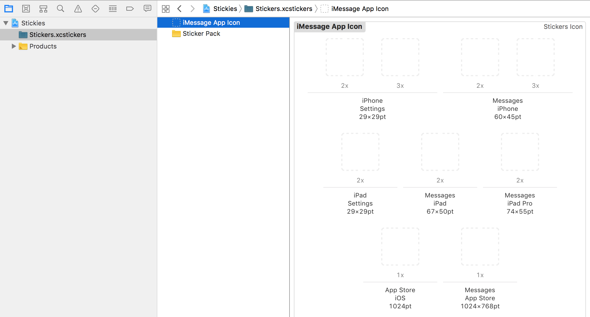
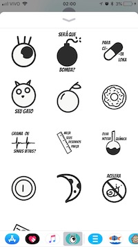
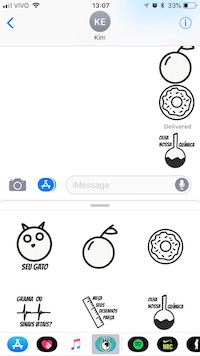
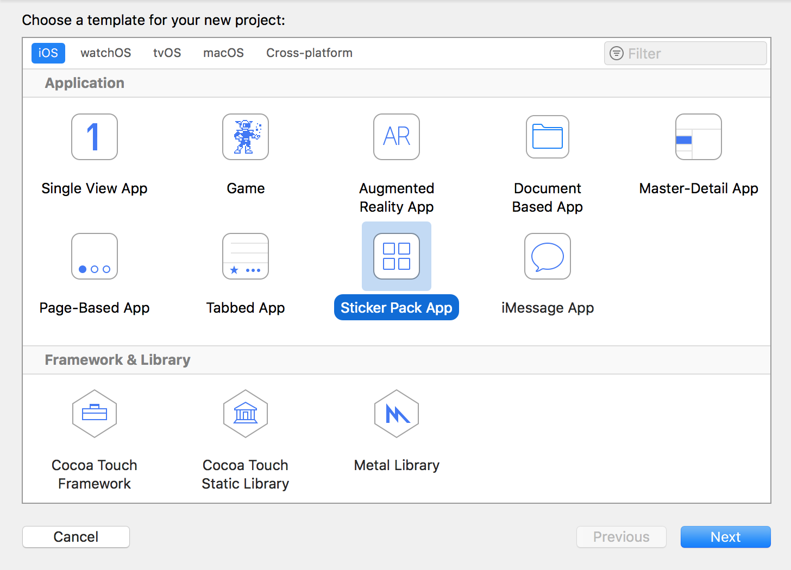
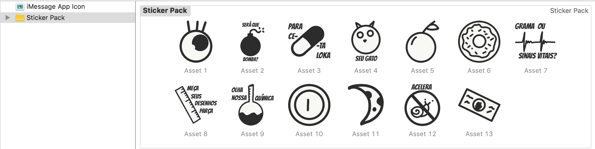
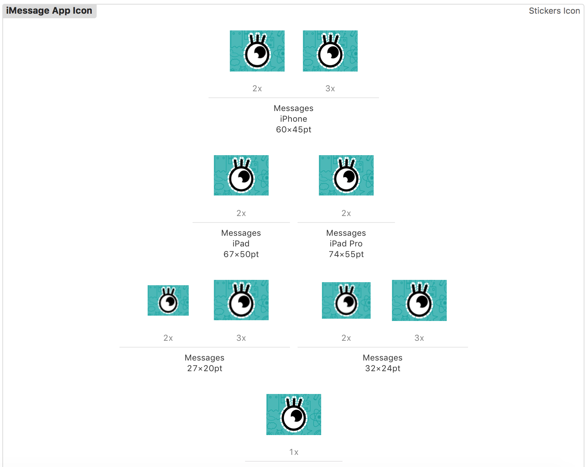

# Create an iOS Sticker App

## What's an Messages app?

It's and app which runs specifically inside the Messages app.

*"But why would I do such a thing?"*

Well, poeple tend to use this app very often, and chat with each other. So, instead of creating an entire chat inside your application, that for the user is anothe environment he needs to learn and feel confortable with, you can send our app into the messages.

There are already a lot of examples such as multiplayer games, shared notes and even financial transaction apps (Banks and Apple Pay).

## And what's a Sticker app?

A sticker app is essentially an iMessages app, BUT it only have stickers.

*"And what are stickers?"*

Some would say the evolution of the emojis, that you cand *drag and drop* directly in any place of your conversation. Here you can see the Sticker extension of the **InterAção**:

  

## Creating an Sticker app

Have you ever wondered if you could create an app without coding?
Well... you don't have to wonder anymore!

A sticker app, can be customized, and changed, and havemo more features (for that you'll definitelly need to code), but the main *framework* you will only need to add your images to the app aaaaaand it's done! Let's see using the InterAção examples:

- Create a new Xcode Project
- Select the Sticker Pack app option

- Add your sticker assets (images) on the **Sticker Pack** folder inside the **Stickers.xcstickers**

- Add the app icon to the **App Icon** inside the same folder

That's it!
You can set the size of your stickers by selecting them and adjusting on the inspector view - the stickers can be small, medium or large
You can make static images stickers or even GIF's creating animated stickers!

And it's a nice way to add a new feature to your application, you can simply add a new Sticker Target to your project, and since it's easy, you can consider to provide a little bit more bonding with your app.

---
Hope you liked it!

Share with me your stickers 👍 ⏀ ☢️ 👾 🐠 ♥️

###### Cover Image: <a style="background-color:black;color:white;text-decoration:none;padding:4px 6px;font-family:-apple-system, BlinkMacSystemFont, &quot;San Francisco&quot;, &quot;Helvetica Neue&quot;, Helvetica, Ubuntu, Roboto, Noto, &quot;Segoe UI&quot;, Arial, sans-serif;font-size:12px;font-weight:bold;line-height:1.2;display:inline-block;border-radius:3px" href="https://unsplash.com/@imgix?utm_medium=referral&amp;utm_campaign=photographer-credit&amp;utm_content=creditBadge" target="_blank" rel="noopener noreferrer" title="Download free do whatever you want high-resolution photos from imgix"><svg xmlns="http://www.w3.org/2000/svg" style="height:12px;width:auto;position:relative;vertical-align:middle;top:-1px;fill:white" viewBox="0 0 32 32"><title>unsplash-logo</title><path d="M20.8 18.1c0 2.7-2.2 4.8-4.8 4.8s-4.8-2.1-4.8-4.8c0-2.7 2.2-4.8 4.8-4.8 2.7.1 4.8 2.2 4.8 4.8zm11.2-7.4v14.9c0 2.3-1.9 4.3-4.3 4.3h-23.4c-2.4 0-4.3-1.9-4.3-4.3v-15c0-2.3 1.9-4.3 4.3-4.3h3.7l.8-2.3c.4-1.1 1.7-2 2.9-2h8.6c1.2 0 2.5.9 2.9 2l.8 2.4h3.7c2.4 0 4.3 1.9 4.3 4.3zm-8.6 7.5c0-4.1-3.3-7.5-7.5-7.5-4.1 0-7.5 3.4-7.5 7.5s3.3 7.5 7.5 7.5c4.2-.1 7.5-3.4 7.5-7.5z"></path></svg>imgix</a>
