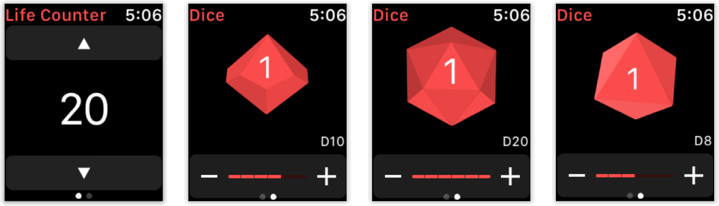
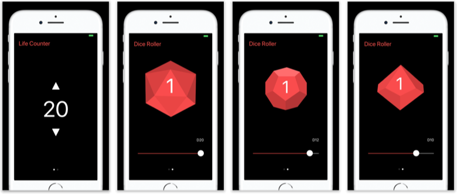

# RPG Kit

This was a nice experiment.

While talking to some friends, we were trying to figure out apps that could be useful on the Apple Watch. One of the things we said was a *RPG Helper* which would contain a few tools to help the players during the game.

But they soon discarded that idea, but I didn't.

And I challenged myself to finish that watch app as fast as I could.

Result: The entire app was made in only 5 hours (including all the assets that I did by myself using Sketch, the watchOS and the iOS app).

RPG Kit is focused on the Apple Watch version, were the player have a simple life counter, and a set of dices to be rolled.

Both these features can easily be accessed by swiping to the sides, since they are side by side on the watch app.

The iOS app is just a copy of the watch app, with the very same features (mainly because an watch app must be connected to an iOS app - it cannot be created as a standalone app).

It may have been easy, but the app is not done yet!
I'm working with a friend to improve the dice animations, and in the future, the iOS and watchOS app are going to be different, were you are going to set some properties and information on your iPhone, and change some other things on your Apple Watch.

___
