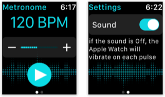
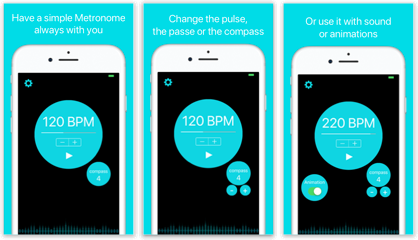
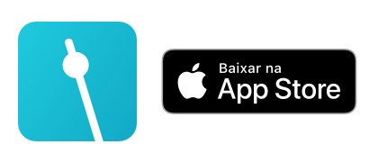

# Pulse Metronome

##### I'm on a sequence of watchOS apps here!

If you don't know, I'm a pianist (or at least I try to be 😘).

So, I'm always looking into areas with musicians where I can try to help using apps.
The **Pulse Metronome** is just a simple Metronome, where you can set the duration of the pulse intervals and the size of the compass.

At the begining I was looking into the Apple Watch app, to see if the metronome could be done using only the watch hapitics (vibrations), 
and yes, it can.

So you can use it only on your Apple Watch, with sound or vibrations.

And we need an iOS app in order to have an app for the Watch, and its basically a mirror of the watchOS app,
but here you can choose to have the pulses with sound, and animations.

___

If you liked it, download on the app store:

