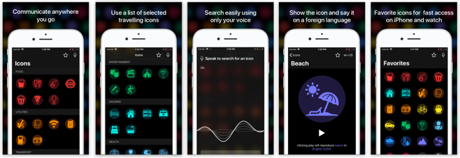
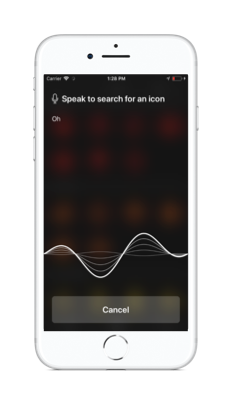
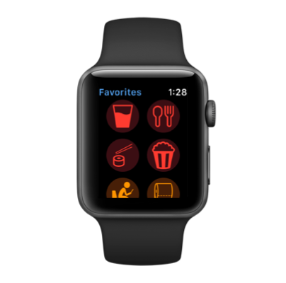

# Iconize

##### [worked as Developer]

The main idea, is helping travelers who go to places where they cannot communicate due to a language problem, so he can use **Iconize** to solve it!

It's a *Universal Language* approach, where the user have a list of selected icons, with the most common things he'll need during a trip, so he can just show the icon and use it to communicate.
He can also use the translation feature of the app, with more than 10 different languages and regions, he can use the app to say the word on a language the person he is talking with could understand.

You can also search for an icon, using only your voice, just tap the microphone button and go for it!

The app is also available for Apple Watch!
With the same features, and it is directly connected to your iPhone app.

Every tume you update your favorites list, the same list will be updated on your watch, so you will have all the icons that matter to you the most always in hand (literally this time 😉).

And the speak features are also available on the Watch.

One of the main ideas of the app, was that travelers could use it even without internet, so all the processing about the icons and the speak recognition is made locally.

My mais contributions for this project was all the Apple watch implementation, the communication, the icons, interaction...
And also I've helped with part of the design and reserach about the icons.

___

Iconize was an app developed in group:

- Giovani Nascimento Pereira (it's me!): Watch Developer
- Danilo Charântola: Back-end Developer
- Alexandre Mestre: Front-end Developer
- Bárbara Gomes: Designer
- Thales Biancalana: Reseracher and Business man

___

If you liked it, download on the app store:

